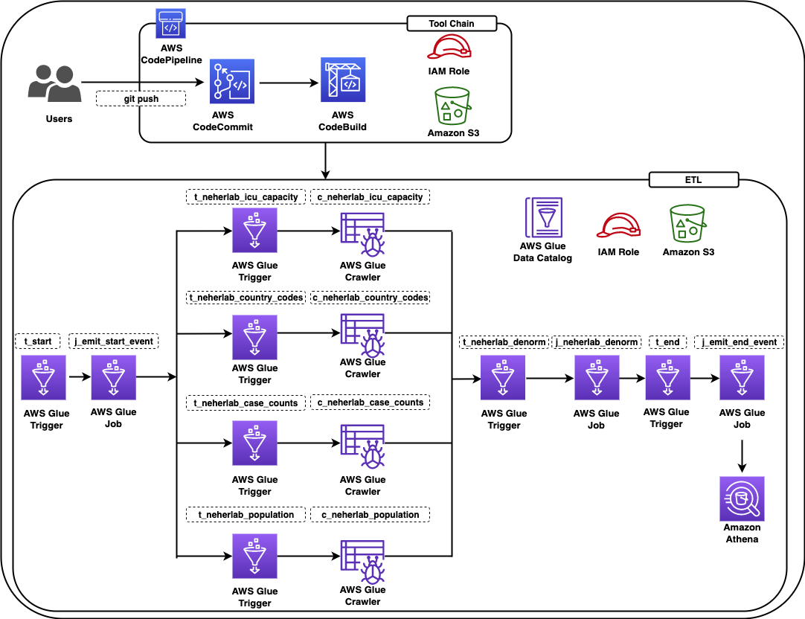

# Build, Test and Deploy ETL solutions using AWS Glue and AWS CDK based CI/CD pipelines

### About The Project

This repository demonstrates building a Continuous Integration and Continuous Delivery (CI/CD) pipeline using AWS CodeCommit, AWS CodeBuild and AWS CodePipeline to provision AWS Glue based data pipelines using AWS Cloud Development Kit (CDK). 

Please refer to the accompanying post [Build, Test and Deploy ETL solutions using AWS Glue and AWS CDK based CI/CD pipelines](https://aws.amazon.com/blogs/big-data/build-test-and-deploy-etl-solutions-using-aws-glue-and-aws-cdk-based-ci-cd-pipelines/) for additional information.

### Solution Overview

The AWS CDK based solution deploys a CI/CD pipeline using AWS CodeCommit, AWS CodeBuild and AWS CodePipeline, executes [docker based PyTests](https://aws.amazon.com/blogs/big-data/develop-and-test-aws-glue-version-3-0-jobs-locally-using-a-docker-container/) and deploys a data pipeline using AWS Glue. The data pipeline consists of AWS Glue Workflow, Triggers, Jobs and Crawlers. The  data pipeline uses [COVID-19 Harmonized Data](https://registry.opendata.aws/talend-covid19/) managed by [Talend / Stitch](https://www.stitchdata.com/) to construct a data pipeline.

### Architecture Diagram

The diagram shows the various components of the solution:

 


### Prerequisites

- An AWS account
- The [AWS Command Line Interface](http://aws.amazon.com/cli) (AWS CLI) [installed](https://docs.aws.amazon.com/cli/latest/userguide/getting-started-install.html)
- The [GIT Command Line Interface](https://github.com/git-guides) (GIT CLI) [installed](https://github.com/git-guides/install-git)
- The [AWS CDK Toolkit (cdk command) installed](https://docs.aws.amazon.com/cdk/v2/guide/cli.html)
- [Python 3](https://www.python.org/downloads/) installed
- Permissions to create AWS resources


### Getting Started

Please follow the below instructions to deploy the solution in your AWS account: 


#### Download the source code [aws-glue-cdk-cicd](https://github.com/aws-samples/aws-glue-cdk-cicd)

```
$ git clone https://github.com/aws-samples/aws-glue-cdk-cicd.git
```

#### Create virtualenv:

```
$ cd aws-glue-cdk-cicd
$ python3 -m venv .venv
```

####  On MacOS and Linux, activate the virtual environment:

```
$ source .venv/bin/activate
```

####  On Windows platform, activate the virtualenv:

```
% .venv\Scripts\activate.bat
```

#### Install required dependencies:

```bash
$ pip install -r requirements.txt
```

#### Bootstrap CDK app:

```bash
$ cdk bootstrap 
```

The above command will create the below CloudFormation stack:

- CDKToolkit.

#### Synthesize CloudFormation template:

```bash
$ cdk synth  # optional if not default (-c stage=default)
```

#### Deploy CodePipeline:

```bash
$ cdk deploy  # optional if not default (-c stage=default)
```

The above command will create the below CloudFormation stack:

- cdk-covid19-glue-stack-pipeline
- cdk-covid19-glue-stack

#### Staring AWS Glue Covid19 Workflow

```bash
$ aws glue start-workflow-run --name Covid_19
 ```

#### Query the tables using Amazon Athena:

```sql
SELECT "country", "location", "date", "cases", "deaths", "ecdc-countries", "acute_care", "acute_care_per_100K", "critical_care", "critical_care_per_100K" FROM "AwsDataCatalog"."covid19db"."neherlab_denormalized" limit 10;
```

<kbd></kbd>

### Cleanup

Log into the AWS console, select the appropriate region, navigate to the AWS CloudFormation console , and select and click Delete on the following stacks:

- cdk-covid19-glue-stack-pipeline
- cdk-covid19-glue-stack 
- CDKToolkit.

Log into the AWS console, select the appropriate region, navigate to the AWS S3 console and delete the associated S3 buckets:

- cdk-covid19-glue-stack-p-pipelineartifactsbucketa-`*`
- cdk-`*`-assets-`<AWS_ACCOUNT_ID>`-`<AWS_REGION>`
- covid19-glue-config-`<AWS_ACCOUNT_ID>`-`<AWS_REGION>`
- neherlab-denormalized-dataset-`<AWS_ACCOUNT_ID>`-`<AWS_REGION>`

## Interested in Contributing?

See [CONTRIBUTING](CONTRIBUTING.md#security-issue-notifications) for more information.

## License

This library is licensed under the MIT-0 License. See the [LICENSE](/LICENSE) file.